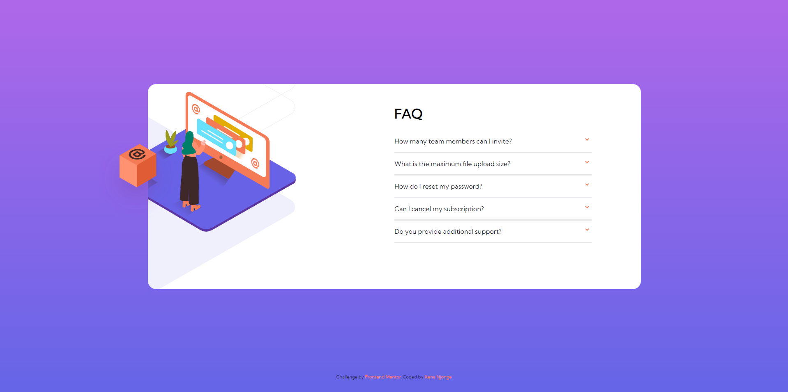

# Frontend Mentor - FAQ accordion card solution

This is a solution to the [FAQ accordion card challenge on Frontend Mentor](https://www.frontendmentor.io/challenges/faq-accordion-card-XlyjD0Oam). Frontend Mentor challenges help you improve your coding skills by building realistic projects. 

## Table of contents

- [Overview](#overview)
  - [The challenge](#the-challenge)
  - [Screenshot](#screenshot)
  - [Links](#links)
- [My process](#my-process)
  - [Built with](#built-with)
  - [What I learned](#what-i-learned)
  - [Continued development](#continued-development)
  - [Useful resources](#useful-resources)
- [Author](#author)

## Overview

### The challenge

Users should be able to:

- View the optimal layout for the component depending on their device's screen size
- See hover states for all interactive elements on the page
- Hide/Show the answer to a question when the question is clicked

### Screenshot

### Links

- Solution URL: [Add solution URL here](https://your-solution-url.com)
- Live Site URL: [Add live site URL here](https://your-live-site-url.com)

## My process

I start off with looking at the design page and trying to figure out exactly where I will need a div. If their displas type is instrumental to the design, I add a suitable diplay style in my css, I also add height and width information. I then populate these divs with semantic elements, and finally the content. From here I move on to the js as I could foresee exactly the type of function that I needed. I then wrote my css and tested the js function on one of the divs. While testing the js function, I noticed some things that I needed to change in the "text-divs". I overhauled alot of what I had initially done in the divs, but this was really a non issue as all the divs were identical, so I could just copy-paste and change a few stuff. After that I did the images on the right and finally the attribution.

### Built with

- Semantic HTML5 markup
- CSS custom properties
- Flexbox
- CSS Grid
- JavaScript

### What I learned

I learned how to work with z-index a little bit more comfortably. I got more comfortable with creating pages that use only JavaScript to change the content that is displayed. I used flexbox to center the item within a container from the beginning, so that I didn't have to go around adding or subtracting margin as to make the content look good. This si something I am proud of as the project that I did last week did not have this functionality and is only "pseudo-centered".  I got more comfortable with structuring the page before even touching the css, this made it easier to fix stuff down the line, as I already had all the items in distinctly named classes. I defined the variables of the colours that I was going to use at the very start of the css to make assigning colours less of a hassle. I got better at naming classes, my names somehow feel more logical than before and by just looking at the class names, one has a good idea of what I intended them to be and what functionality threy have.

### Continued development

Althought the finished product looks great, I must admit to myself, that images are by far the biggest bane of my existence. To be fair with myself, I did do considerably better than on previous projects, but I also have to admit, that I initially started off with the images on the left, but moved on to the text after a considerable amount of time without having completed anything due to being burned out when my css was not doing what I wanted it to do. I am trying to hone my skills with images, and they are slowly getting better, I hope that in 2 projects I can say that I am comfortable with manipulating images.

### Useful resources

- [W3Schools](https://https://www.w3schools.com/) 
- [MDN](https://www.example.com) 

As always, a huge shoutout to the folks down at W3Schools and Mozilla for the great resources that they provide.

## Author
- Frontend Mentor - [@Kena-Njonge](https://www.frontendmentor.io/profile/Kena-Njonge)
# FAQ-accordion-card
